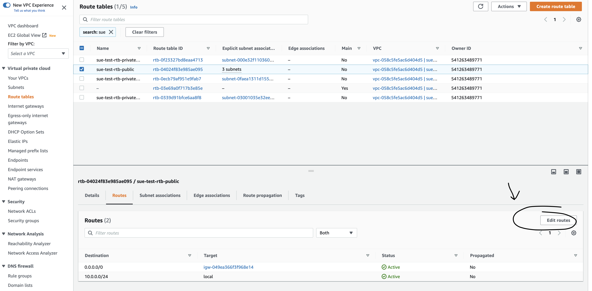
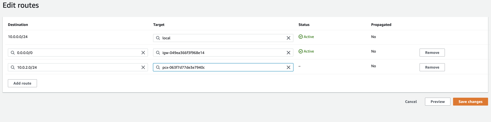
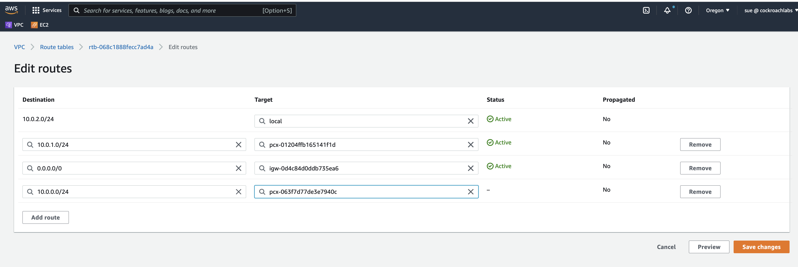
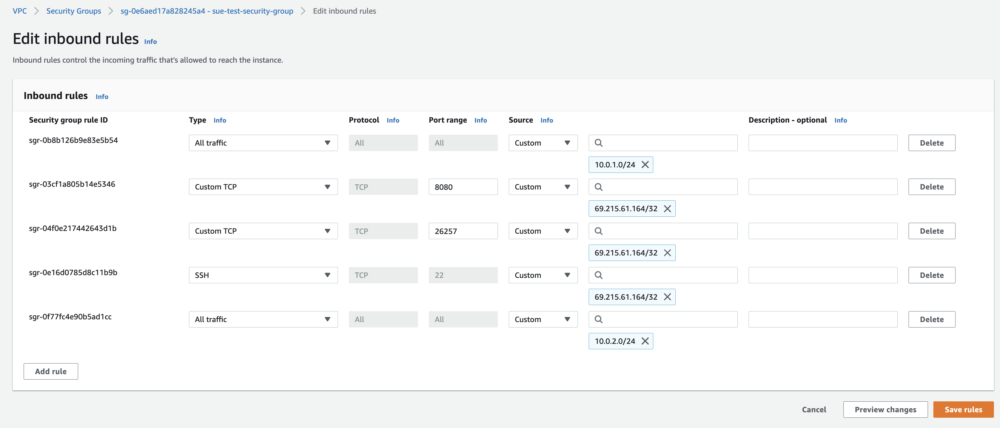

# Configuring Multi Region in AWS for CRDB

This document articulates the manual configuration that is required to configure a Multi-Region Setup in AWS.

### Pre-requisites
* Understanding how to deploy in AWS & have working knowledge of how to deploy a single region instance of CRDB in AWS, for more info, refer to: [Deploy on AWS](https://www.cockroachlabs.com/docs/v22.2/deploy-cockroachdb-on-aws)
* Understand the supported Hardware, software requirements required for Multi-Region setup, for more info, refer to:[Production Checklist](https://www.cockroachlabs.com/docs/v22.2/recommended-production-settings) 
* Review the Topology Patters to understand what capability is needed for your cluster, for more info, refer to: [Topology Patters](https://www.cockroachlabs.com/docs/v22.2/topology-patterns)
* Lastly, you must have at-least 3 regions of CRDB instances created before you proceed with the document.
> Note: We assume you have already created 9 instances of single CRDB, 3 per region for this exercise, For illustration purposes we are using 3 AWS regions here, Oregon, Virginia & Ohio as in West, East & Central, We have 3 instances deployed in each region, one per AZ. so making it 9 total nodes. 

### Peering Connections
- First Step to configuring these nodes is to configure peering connections between the regions. 
- You require one peering connection between each region to be able to communicate.
- For instance, to configure 3 regions, Oregon, Virginia & Ohio, you require 3 peering connections as follows,
  * Oregon <---------> Ohio (Two-Way)
  * Oregon <---------> Virginia (Two-Way)
  * Virginia <-------> Ohio (Two-Way)
  
- In order to correctly create a peering connection, you need to follow these steps for each connection.
- 1. Setup a Peering Connection
- 2. Accept the Peering Connection Request
- 3. Modify the Route Tables
- 4. Modify Security Groups

#### Step1: Setting up a Peering Connection
- Login to the AWS Console, from the selection dropdown, go to first region, Oregon & Navigate to `VPC` & select `Peering Connections`
- In the `Create Peering Connection` Window, Enter the Name for the connection.
- Select the Local `VPC ID` that you need to establish the connection with.
- Under `Select another VPC to peer with` check `My Account` & under `Region` select `Another Region`.
- Within the `Another Region` drop down you should see the second region that your want to configure with, I've selected Ohio for instance. 
- Also select the `VPC ID` of your VPC that you have hosted the CRDB instances in the second region.
- See the below image for reference:
- 
>Note that this is only one connection between Oregon & Ohio, you'll need to repeat this for the other 2 connections.

#### Step2: Accepting the Peering Connection Request
- Once the peering connection in first region, Oregon is created successfully, Navigate to the second region, Ohio.
- Go to `VPC`, select `Peering Connection` & you should be able to see a pop up with `Pending Acceptance` with the `Actions` dropdown enabled next to it.
- Click on `Actions` drop down and select `Accept`
- The Peering connection between Oregon <-------> Ohio is now completed.
- See below image for reference
- 
>Note that this is only one connection between Oregon & Ohio, you'll need to repeat this for the other 2 connections.

#### Step3: Modify Route Tables
- Under the `VPC` menu, select `Route Tables`
- Search for your public route table which has subnets and click on it.
- Go to Routes section under this table & click `Edit Routes`.
- See the below image for reference on how to configure the first region(oregon) in the Second(ohio).
- 
- Add the `CIDR` block for the first region into the `Destination`. For this illustration, Oregon's CIDR block addresses in Ohio.
- Add the Peering connection as the `Target` & Click on `Save Changes` to save your edits.
- See below image on how to edit the routes in Ohio region: 
- 

- Now, you'll have to do the same in the First Region as well to add the Second region's Route. For this example, Ohio's CIDR block addresses in Oregon's.
- Go to the `VPC` --> select `Route Tables`
- Search for the public route table in that vpc, with subnets
- Modify the Routes by adding the second region's CIDR addresses as destination & peer connection as target in first region. For this example, its Ohio's in Oregon.
- See below image on how to edit the first region routes
- 

> Note that this is only for one connection between Ohio & Oregon, you'll need to do the same for the other connections as well.
#### Step4: Modify Security Groups
- You can do this step after the above changes are done for each connection. That means, before this step, you must have created 3 peering connections, modified the route tables in 3 regions to have each other's CIDR blocks in the routes. so, lets see how to modify the security groups.
- Go to first region's `Security Groups` from the `VPC Menu`
- Select the Public Security group and click on `Edit Inbound Rules`
- In the Edit Inbound Rules section, Add the CIDR address blocks for the other two regions to allow the traffic between the nodes.
- See below image reference for editing the inbound rules in Ohio:
- 
- Finally, once the settings are saved, continue to other 2 regions to do the same and modify te inbound rules to allow communication between the nodes.
- After completing the configuration in all the 3 regions, you have now successfully established a secure peering connection that is required to configure a multi region.
- you may now proceed to configuring the multi-region capabilities for CRDB.

