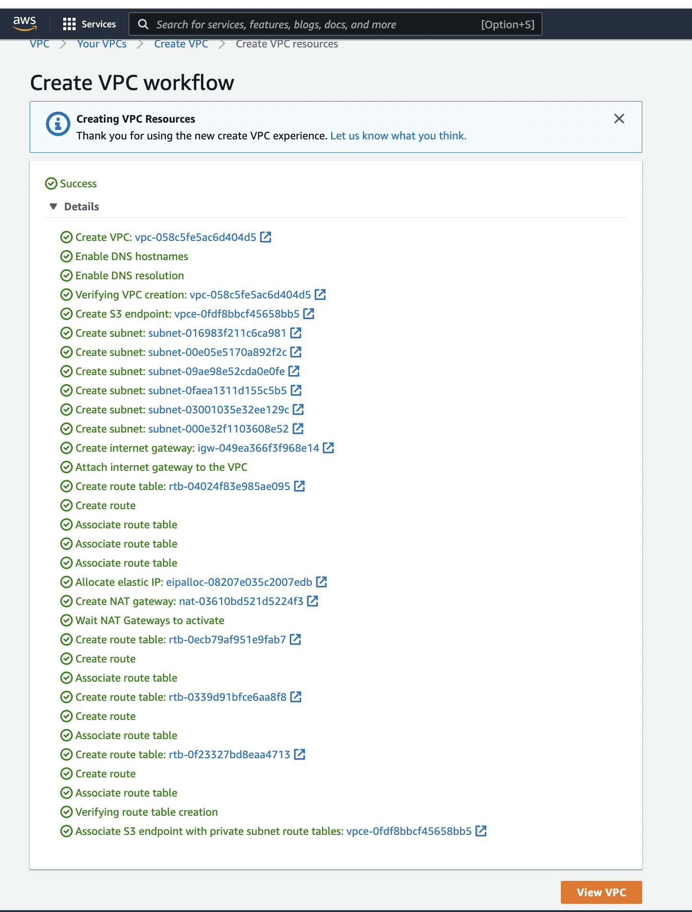
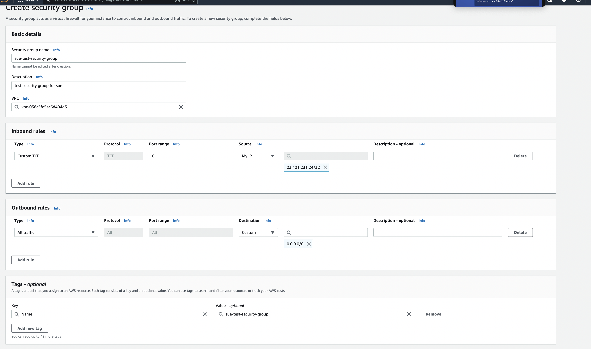
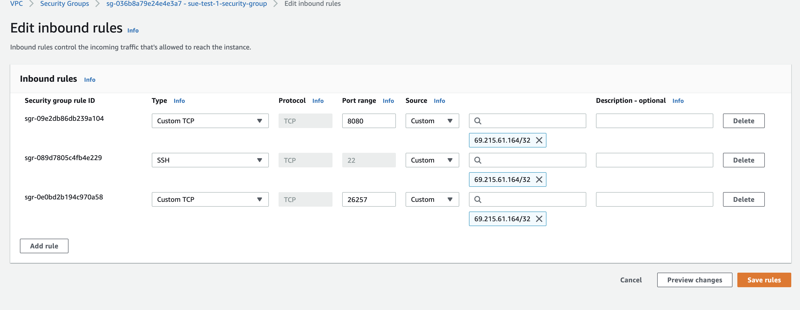
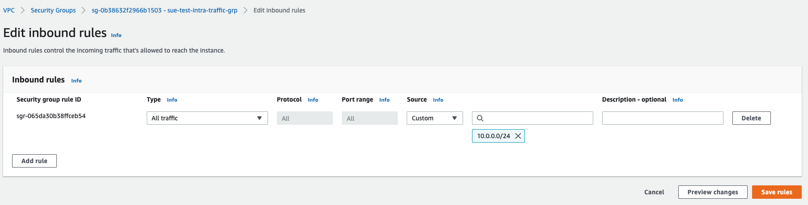
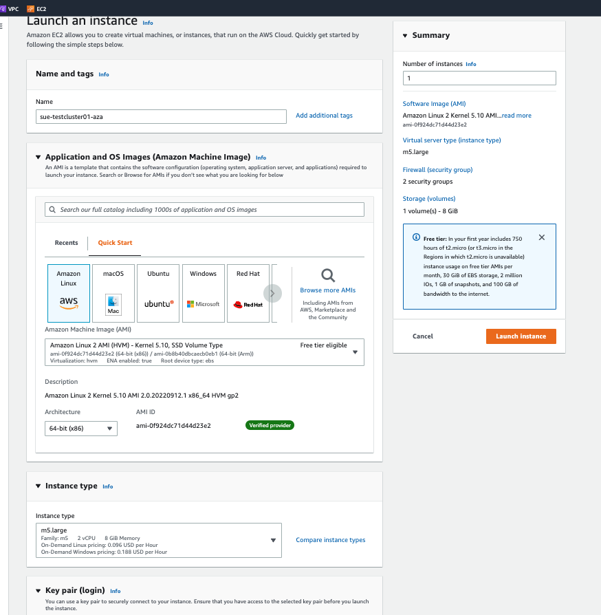
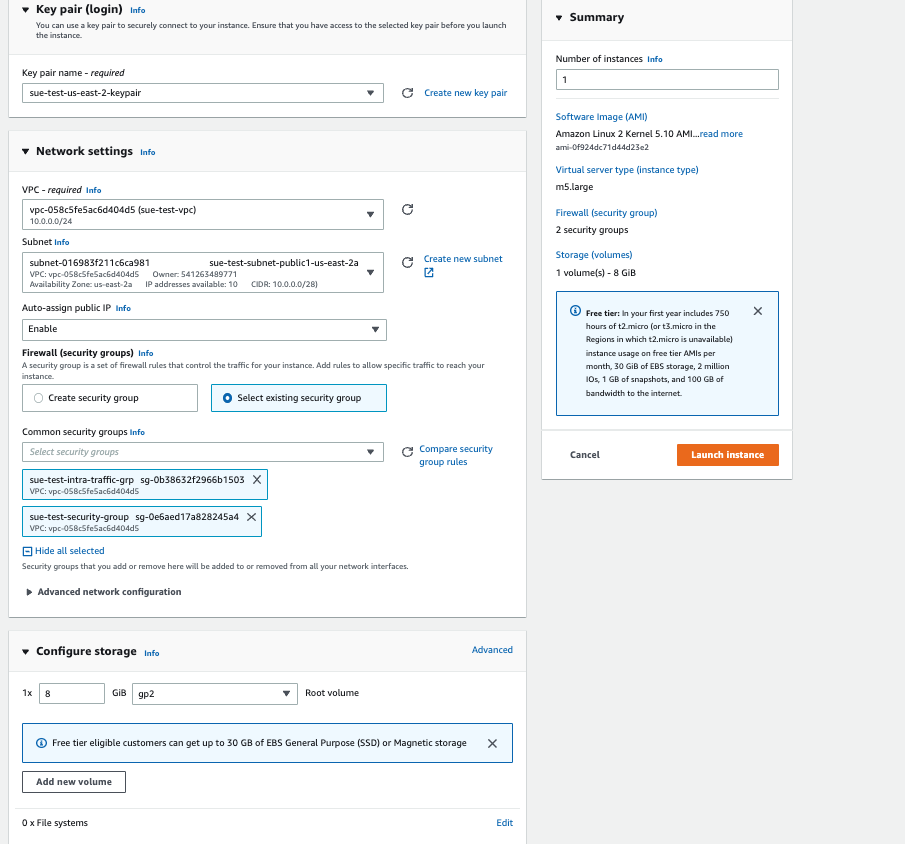
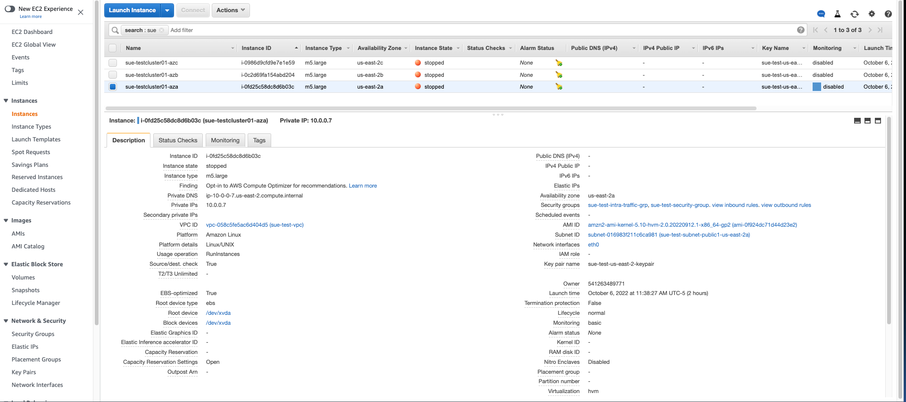

# Manual Components Setup Required for Self Hosting CRDB on AWS.

Following this document will help you create the necessary Components required to self host CRDB. Things that will be covered in this article are:
>
> 1. How to set up VPC, Subnet, RouteTables , IG
> 2. How to configure Security Groups
> 3. How to create an Instance

Estimated Time to do the Setup ~15 min

## Pre-requisites before starting

```Before going through the document, Please go through the official CRDB article to understand the setup and High level Architecture :```[Deploy on AWS](https://www.cockroachlabs.com/docs/v22.2/deploy-cockroachdb-on-aws)<br />  
  1. Should have an AWS Account
  2. Should have basic familiarity with AWS console to create components like, Amazon VPC, Subnets, Internet gateways, Route tables, AWS VPN, Elastic Load Balancing.

## Setting up VPC & Required Resources
Using the latest AWS console you can set up the VPC and its required components at a single click. 
1. From the Search Bar, Navigate to VPC in the AWS console.
- Vpc --> create Vpc
- In the VPC settings, select `Vpc and more`
- For Auto generation of name, you can enter a consistent name that will be appended for all the resources, in order to do so, you need to check the `Auto-generate` checkbox under `Name tag auto-generation`
- Input the `IPv4 CIDR block` with the CIDR notation you want. you can read more about this in the `info` section next to the block.
- Select the number of Availability Zones (AZs) you would like to provision the subnets. Refer to the production checklist or the architecture reference in the `Deploy on AWS` page for more information. In our case, we are going to select 3 to make the system resilient & highly available.
- Select `3` for private & public subnets since that is the minimum required subnets based of our selected Azs.
- Select Gateways & VPC endpoint if you require the system to be setup with a load balancer.
-  see below image for reference
- 
  With the VPC and more feature, Your VPC, Subnets, route tables & internet gateways are now created at a single click.
  While the resources are being created, you can see the progress during the creation workflow.
- 
- You can verify that you have all the above list of resources are now created. 
- You have now successfully completed the VPC creation.
- Now, Proceed to creating Security Group. 
- Under `Vpc tab` select `Security Group` and select `create security group`
- Select the Basic Details to name the group, description & select the VPC that we just created.
- select the inbound rules to open the ports `8080`,`26257` & `ssh` 
- you'll also require to add `your ip` address to access the instances from your local.
- For outbound rules, you need to open outbound traffic on all the addresses so, you'll need to add `0.0.0.0/0` as well.
- See below image for reference on how to create the Security group and add inbound rules: 
- 
- 
- Now, the first Security group is completed, However you need another security group to manage the intra node traffic.
- Go ahead and create another security group and provide a unique suffix like `intra` to differentiate the above one from this new group.
- The intra group should have inbound rules to allow all traffic from the VPC ip address range.(same CIDR block that you added while creating the VPC)
- Create an inbound rule in the intra security group to allow  `All Traffic` on the `CIDR block` for VPC.
- See below image for reference on how to create the inbound rules for intra security group:
- 

Now your VPC setup with Security group, Inbound/outbound rules is completed. You can proceed with Instance creation.

## Creating Instances & Required Configuration

Before you create instances, its recommended to create Key pairs which enable you to connect to these instances later on.

> ####Creating Key Pairs:
> - Go to Network & Security --> Key Pairs
> - Create Key Pair --> select if your key type & format ( you need .pem for OpenSSH & .ppk for Putty)
> - download the key pairs and save it in an accessible location for later. 
> Note that, Once the Key Pair is created, you can't download the key files again. 

####Launching Instances:
When we created the VPC, we selected 3 Az's and to deploy CRDB in each AZ, we require 1 instance per az, making it a total of 3 instances. you'll need to repeat the same steps 3 times while changing the public subnet per az.
- Using the Search Bar, Navigate from `Ec2` -> `Instances`
- Click on `Launch an instance`
- Populate the Name for the instance while keeping it relevant to the az.
- Select the OS image, hardware specifications for this instance
- From the `Instance Type` drop down, select the `Instance Type` that you'd like to choose. (For testing purposes we are going with m5.Large in this article)
- Once the instance is selected, Select the Key Pair that we created in the beginning here. 
- Configure the `Network Settings` by selecting the `VPC` we created in the above steps
- From the `Subnets` dropdown, pick the `public az` subnet (you'll need one instance per one public az)
- Make sure `Auto Assign Public IP` is Enabled.
- For the Firewall configurations, Select -> `select existing security group` and pick both the security groups (default & intra) from before.
- Make sure all the configurations were set up correctly and click `Launch Instance`, You can use the below images as reference. 
- 
- 
- 
- ****NOTE: Repeat the above steps for 2 more instances, one per az & one per public subnet of the az. so, the final output looks similar to the last reference image****

TADA!! there you go, Not that hard right ??... You have now successfully completed the required AWS components to install cockroach DB. You can use your choice of openSSH to connect to the instances & install cockroach DB securely. You can now follow the steps from the below document to complete the set up.
[Deploy on AWS](https://www.cockroachlabs.com/docs/v22.2/deploy-cockroachdb-on-aws)<br /> 